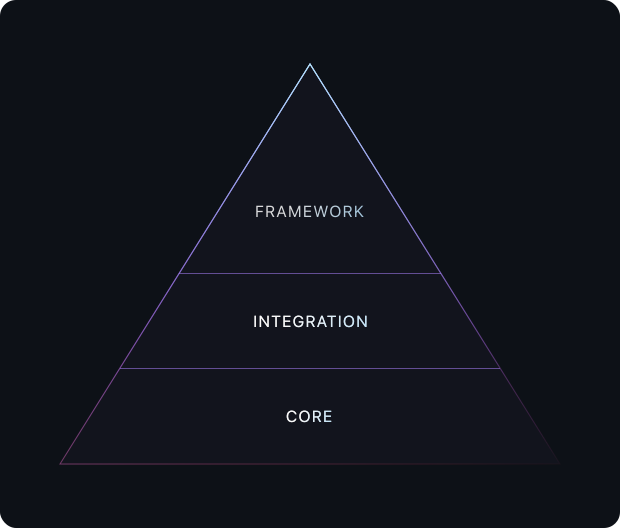

# Contributing to Prismic

This document is aimed at providing developers (mainly maintainers) documentation on this project and its structure. It is not intended to pass requirements for contributing to this project.

For the latter, the [Quick Start](#quick-start) section below can help you. You are free to [open issues][repo-issue] and [submit pull requests][repo-pull-requests] toward the `master` branch directly without worrying about our standards. For pull requests, we will help you through our merging process.

> For a Table of Contents, use GitHub's TOC button, top left of the document.

## Quick Start

```bash
# First, fork the repository to your GitHub account if you aren't an existing maintainer

# Clone your fork
git clone git@github.com:<your-username>/prismic-gatsby-early-access.git

# Create a feature branch with your initials and feature name
git checkout -b <your-initials>/<feature-or-fix-description> # e.g. `lh/fix-win32-paths`

# Install dependencies with npm
npm install

# Test your changes
npm run test

# Commit your changes once they are ready
# Conventional Commits are encouraged, but not required
git add .
git commit -m "short description of your changes"

# Lastly, open a pull request on GitHub describing your changes
```

## Processes

Processes refer to tasks that you may need to perform while working on this project.

### Developing

There is no development branch. The `master` branch refers to the latest [stable (living) version](#stable-xxx) of the project and pull requests should be made against it.

If development on a [new major version](#iteration-cycle) has begun, a branch named after the major version will be created (e.g. `v2` for work on the future `v2.0.0` of the project). Pull requests targeting that new major version should be made against it.

To develop locally:

1. **If you have maintainer access**:<br/>[Clone the repository](https://help.github.com/articles/cloning-a-repository) to your local environment.

   **If you do no have maintainer access**:<br/>[Fork](https://help.github.com/articles/fork-a-repo) and [clone](https://help.github.com/articles/cloning-a-repository) the repository to your local environment.

2. Create a new branch:

```bash
git checkout -b <your-initials>/<feature-or-fix-description> # e.g. `aa/graphql-support`
```

3. Install dependencies with [npm][npm] (avoid using [Yarn][yarn]):

```bash
npm install
```

4. Start developing:

```bash
npm run dev
```

5. Commit your changes:

   If you already know the [Conventional Commits convention][conventional-commits], feel free to embrace it for your commit messages. If you don't, no worries; it can always be taken care of when the pull request is merged.

### Building

Our build system is handled by [siroc][siroc], a near-zero-config build tool powered by [esbuild](https://github.com/evanw/esbuild). It takes care of:

- Generating a [CommonJS (`.cjs`)](https://nodejs.org/docs/latest/api/modules.html#modules_modules_commonjs_modules) bundle and its source map;
- Generating an [ECMAScript (`.mjs`)](https://nodejs.org/docs/latest/api/modules.html#modules_modules_commonjs_modules) bundle and its source map;
- Generating a TypeScript declaration (`.d.ts`) file.

To build the project:

```bash
npm run build
```

The CI system will try to build the project on each commit targeting the `master` branch. The CI check will fail if the build does.

### Testing

All projects have at least linting and unit tests. Linting is handled by [ESLint][eslint] with [Prettier][prettier] and unit tests are handled by [Vitest][vitest].

To run all tests:

```bash
npm run test
```

If you'd like to run only the linter (note that it won't reformat your code; use the `format` script for that):

```bash
npm run lint
```

If you'd like to run only the unit tests:

```bash
npm run unit
```

If you'd like to run only the unit tests in watch mode (re-runs tests each time a file is saved):

```bash
npm run unit:watch
```

When working on unit tests, you might want to update snapshots (be careful when doing so):

```bash
npm run unit -- --update-snapshots
```

The CI system will run tests on each commit targeting the `master` branch. The CI check will fail if any test does.

### Publishing

> ⚠ &nbsp;Only project maintainers with at least collaborator access to the related npm package can publish new versions.

Publishing a package correctly involves multiple steps:

- Writing a changelog;
- [Building](#building) the project;
- Publishing a new version tag to GitHub;
- Publishing build artifacts to [npm][npm].

In order to make sure all these steps are consistently and correctly done, we use [Standard Version][standard-version] and build scripts.

To release a new version of the project:

```bash
npm run release
```

To release a new [alpha](#alpha-xxx-alphax) version of the project:

```bash
npm run release:alpha
```

Those scripts will:

- Run tests and try to build the project;
- Figure out the new version number by looking at commit messages matching the [Conventional Commits convention][conventional-commits];
- Write the [changelog][changelog] for the new version after Conventional Commit messages;
- Build the project for publishing;
- Publish a new version tag to GitHub;
- Publish build artifacts to [npm][npm].

Once a script has been run successfully, a new version of the package should have been published to npm. To complete the publishing process you only need to head to the repository's releases tab on GitHub to publish the new version tag that was created.

If you ran any of those commands but happen not to have access to the related npm package, you can still ask a collaborator of the said package to publish it for you.

Appending `:dry` (e.g. `release:dry`) to any of the above commands will dry-run the targeted release script and output the new changelog to the console.

We consider maintaining project dependencies before publishing a new version a best practice.

### Maintaining

Anyone can, and is welcome to, contribute to the project by opening bug reports and submitting feature requests. To remain focused and ensure we are able to respond to each contribution, we have adopted the following framework to maintain this package:

**🚨 &nbsp;Bug reports**

> **Note**: An automated reply is posted when a bug report is opened to explain our maintenance schedule.

Every Wednesday is _bug squashing day_. During this day, we respond to and/or fix bug reports.

At the end of each Wednesday (assuming there were issues to fix), or later during the week if reviews are required, a _patch_ version is [released](#publishing) containing any fixes that were needed. Releasing multiple patches during the same week should be avoided.

Ideally, all opened bug reports are addressed each Wednesday. If a particular bug report is not able to be resolved in that timeframe, maintainers are free to continue working on the issue or to report back to it next Wednesday. Overall, while most issues should be closed within _7 days_, we consider up to _14 days_ to get back to and address an issue a reasonable delay. Beyond that threshold, an issue is considered problematic and will be given more attention.

**🙋‍♀️ &nbsp;Feature requests**

> **Note**: An automated message gets sent to people creating feature requests about this process.

Every last week of a month is _feature week_. During this week, we implement new features. Discussing and coming up with implementation proposals can happen before that week, but implementations are targeted for the last week.

At the end of the week (assuming there were features to implement), a _minor_ version is [released](#publishing) containing the new features. Releasing multiple minors during the same week should be avoided.

Ideally, all opened feature requests are discussed each month and implemented if consensus was reached. Unlike bug reports, we do not consider delays to address feature requests as good or bad. Instead, those should essentially be driven by the community's demand on a per-request basis.

**🏗 &nbsp;Updating the project structure**

We actively maintain a [TypeScript template][template] with Prismic's latest open-source standards. Keeping every project in sync with this template is nearly impossible so we're not trying to immediately reflect changes to the template in every project. Instead we consider a best practice to manually pull changes from the template into the project whenever someone is doing project maintenance and has time for it, or wants to enjoy the latest standards from it.

## `package_name` in Prismic's Open-Source Ecosystem

Prismic's Open-Source ecosystem is built around a 3-stage pyramid:

<p align="center">
	
</p>

Where:

- **Core**: Represents libraries providing core Prismic integration such as data fetching and content transformation, e.g. [`@prismicio/client`](https://github.com/prismicio/prismic-client);
- **Integration**: Represents libraries to integration into UI libraries. They must be framework agnostic, e.g. [`@prismicio/react`](https://github.com/prismicio/prismic-react);
- **Framework**: Represents libraries to integrate into frameworks, including data fetching and normalizing. They must follow frameworks' expected practices, e.g. [`@prismicio/next`](https://github.com/prismicio/prismic-next).

This package is a **Framework** library.

## Iteration Cycle

We break iteration cycle of a project's library into 4 phases:

- **Pre-alpha**
- **Alpha**
- **Beta**
- **Stable**

### Pre-alpha

> At any point we might feel the need to introduce breaking changes to a project's library (getting rid of legacy APIs, embracing latest features from a framework, etc.). When such a need has been identified for a project, it will enter the pre-alpha phase. The project might also enter the pre-alpha phase for large, non-breaking changes that need more planning and thoughts.
>
> The goal of the pre-alpha phase is to design and share the new project's library API through an RFC. Under certain circumstances (e.g. the API has already been clearly defined in another language and only some adaptations have to be made), the project can skip the pre-alpha phase and enter the alpha phase directly. Skipping the pre-alpha phase should be treated as an exception.

During the pre-alpha phase, the following will happen:

**Documenting and understanding the library's current functionality:**

Doing so leads to a better understanding of the library's current functionality and limitations. Reviewing GitHub Issues will provide insight into existing bugs and user requests. We want to reduce the number of breaking changes where possible while not being afraid to do so if necessary.

**Sketching the API in code, examples, and written explanations:**

The library should be written in concept before its concrete implementation. This frees us from technical limitations and implementation details. It also allows us to craft the best feeling API.

**Writing the public RFC:**

A formal RFC should be posted publicly once the initial brainstorming session is complete that focuses on new and changed concepts. This allows everyone to read and voice their opinions should they choose to.

### Alpha (`x.x.x-alpha.x`)

> As soon as the RFC has been posted, the project enters the alpha phase.
>
> The goal of the alpha phase is to implement the new project's library API, to test it, and to document it.

During the alpha phase, the following will happen:

**Writing the implementation:**

The implementation must be done in TypeScript and include extensive tests and in-code documentation. Generally the process goes as follows:

1. Writing the implementation in TypeScript;
2. Testing the implementation;
3. Documenting the implementation with TSDocs (at least all publicly exported APIs).

**Publishing public alpha versions:**

Publishing alpha versions of the library allows for easier internal testing. With alpha versions, users can test the library as it is published publicly, however those versions are not recommended or shared extensively as breaking changes are still very likely to occur and the library is still not documented. Alpha versions can be published as often as needed.

**Adjusting per internal and external feedback:**

An internal code review should be performed. As users use the alpha, issues will be opened for bugs and suggestions. Appropriate adjustments to the library should be made with a focus on doing what users expect while minimizing technical debt. For that purpose, breaking changes to the new API can be introduced.

**Updating documentation:**

Documentation for the library should be updated on [prismic.io][prismic-docs] and is treated as the primary source of documentation. Contributors will work closely with Prismic Education team to complete this. This involves updating related documentation and code examples as well, including any starter projects on GitHub. A migration guide should be included if necessary.

### Beta (`x.x.x-beta.x`)

> As soon as the implementation is completed and the updated documentation is ready to be published, the project enters the beta phase.
>
> The goal of the beta phase is to test the updated library's API by publicly sharing it with the community and receiving early adopters' feedback. The beta phase is the last opportunity for breaking changes to be introduced.

During the beta phase, the following will happen:

**Publishing public beta versions and related documentation:**

A first beta should be published along the related documentation that has been worked on during the alpha phase. This release should be announced and shared to users in order to get feedback from early adopters. Subsequent beta versions can be published as often as needed, but we have to keep in mind users are now expected to be using them.

**Adjusting per internal and external feedback:**

As users use the beta, issues will be opened for bugs and suggestions. Appropriate adjustments to the library should be made with a focus on doing what users expect while minimizing technical debt. For that purpose, breaking changes to the new API can still be introduced and documentation should be updated accordingly at the moment of publishing a new beta.

### Stable (`x.x.x`)

> Once the beta phase has arrived to maturity (users seem to be happy with it, all issues and concerns have been addressed, etc.), the project enters the stable phase.
>
> The goal of the stable phase is to publish the new project version and to advocate it as Prismic's latest standard. During this "living" phase of the project bug fixes and new features will be added. If the need for breaking or large changes arises, the project will enter the pre-alpha phase and begin a new cycle.

During the stable phase, the following will happen:

**Publishing public stable versions and related documentation:**

The first stable version should be published along the related documentation. This release should be announced and shared to users extensively in order to get them up to Prismic latest standard. Subsequent stable versions can be published as often as needed but a particular attention should be paid toward testing and avoiding regressions.

**Implementing new features:**

New features can be implemented during the stable phase following user suggestions and new use cases discovered. To be published, new features should be extensively tested. Ideally, documentation should be updated at the time of publishing, however a delay is tolerated here as it requires coordination with the Prismic Education team.

**Adding new examples:**

While examples can be added at any time, it's certainly during the stable phase that most of them will be added. Examples should be added whenever it feels relevant for a use case to be pictured with a recommended recipe, allowing for later shares of said examples.

## Project Structure

> Prismic open-source projects have been structured around standards maintainers brought from their different background and agreed upon on. They are meant to implement the same sensible defaults allowing for a coherent open-source ecosystem.
>
> Any changes to this structure are welcome but they should be first discussed on our [TypeScript template][template-issue]. Common sense still applies on a per-project basis if one requires some specific changes.

Project is structured as follows (alphabetically, folders first):

### 📁 &nbsp;`.github`

This folder is used to configure the project's GitHub repository. It contains:

**Issue templates (`ISSUE_TEMPLATE/*`)**

Those are used to standardize the way issues are created on the repository and to help with their triage by making sure all needed information is provided. Issue templates are also used to redirect users to our [community forum][community-forum] when relevant.

**Pull request templates (`PULL_REQUEST_TEMPLATE.md`)**

This one is used to standardize the way pull requests are created on the repository and to help with their triage by making sure all needed information is provided.

**CI configuration (`.github/workflows/ci.yml`)**

Our CI workflow is configured to run against all commits and pull requests directed toward the `master` branch. It makes sure the project builds and passes all tests configured on it (lint, unit, e2e, etc.) Coverage and bundle size are also collected by this workflow.

### 📁 &nbsp;`dist`

This folder is not versioned. It contains the built artifacts of the project after a successful build.

### 📁 &nbsp;`examples`

This folder contains examples of how to use the project. Examples are meant to be written over time as new use cases are discovered.

### 📁 &nbsp;`playground`

This folder might not be available in this project. If it is, it is meant to contain a playground for developers to try the project during the development process.

Scripts such as `playground:dev` or `playground:build` might be available inside the project [package.json](#-packagejson) to interact with it easily.

### 📁 &nbsp;`src`

This folder contains the source code of the project written in TypeScript. The `index.ts` file inside it should only contain exports made available by the project. It should not contain any logic.

### 📁 &nbsp;`test`

This folder contains tests of the project written in TypeScript. It may contain the following subdirectory:

**Fixtures (`__fixtures__`)**

This folder contains [fixtures](https://en.wikipedia.org/wiki/Test_fixture) used to test the project.

**Test Utils (`__testutils__`)**

This folder contains utility functions used to test the project.

**Snapshots (`snapshots`)**

This folder contains snapshots generated by the test framework when using snapshot testing strategies. It should not be altered manually.

### 📄 &nbsp;`.editorconfig`, `.eslintrc.cjs`, `.prettierrc`, `.size-limit.json`, `.versionrc`, `vitest.config.ts`, `siroc.config.ts`, `tsconfig.json`

These files contain configuration for their eponymous tools:

- [EditorConfig][editor-config];
- [ESLint][eslint];
- [Prettier][prettier];
- [Size Limit][size-limit];
- [Standard Version][standard-version];
- [Vitest][vitest];
- [`siroc`][siroc];
- [TypeScript][typescript].

Any change to those files are welcome but they should be first discussed on our [TypeScript template][template-issue]. Common sense still applies if the project requires some specific changes.

### 📄 &nbsp;`.eslintignore`, `.gitignore`, `.prettierignore`

These files contain ignore configuration for their eponymous tools. Ignore configuration should be based on the one available from `.gitignore` and extended from it.

### 📄 &nbsp;`.gitattributes`

This file contains [attributes](https://git-scm.com/docs/gitattributes) used by Git to deal with the project's files. Our configuration makes sure all files use correct line endings and that lock files aren't subject to conflicts.

### 📄 &nbsp;`CHANGELOG.md`

This file is automatically generated by [Standard Version](https://github.com/conventional-changelog/standard-version) according to commit messages following the [Conventional Commits specification][conventional-commits] whenever a release is made.

### 📄 &nbsp;`CONTRIBUTING.md`, `README.md`

These files contain project's related information and developers (maintainers) documentation.

### 📄 &nbsp;`LICENSE`

This file contains a copy of the project's Apache 2.0 license we use on this project. The Apache 2.0 license has a few more restrictions over the MIT one. Notably (not legal advice), any change by a third party to Apache 2.0 licensed code is required to be stated by the third party. Same applies for changes to the project name by a third party (still not legal advice). For full details refer to the [Apache 2.0](https://www.apache.org/licenses/LICENSE-2.0) license text itself.

### 📄 &nbsp;`package-lock.json`

This file is the lock file generated by [npm][npm] to represent the resolved dependencies used by the project. We use npm over [Yarn][yarn] to manage dependencies and only this lock file should be versioned (`yarn.lock` is even ignored to prevent mistakes).

### 📄 &nbsp;`package.json`

The project's package definition file.

**Scripts (`scripts`)**

- `build`: Builds the project;
- `dev`: Builds the project with watch mode enabled;
- `playground:*`: Any command related to the project [playground](#-playground) if any;
- `format`: Runs Prettier on the project;
- `prepare`: npm life cycle script to make sure the project is built before any npm related command (`publish`, `install`, etc.);
- `release`: creates and publishes a new release of the package, version is determined after commit messages following the [Conventional Commits specification][conventional-commits];
- `release:dry`: dry-run of the `release` script;
- `release:alpha`: creates and publishes a new alpha release of the package;
- `release:alpha:dry`: dry-run of the `release:alpha` script;
- `lint`: Runs ESLint on the project;
- `unit`: Runs Vitest on the project;
- `unit:watch`: Runs Vitest on the project in watch mode;
- `size`: Runs Size Limit on the project;
- `test`: Runs the `lint`, `unit`, `build`, and `size` scripts.

**Minimum Node version supported (`engines.node`)**

The minimum Node version supported by the project is stated under the `engines` object. We aim at supporting the oldest Long Term Support (LTS) version of Node that has still not reached End Of Life (EOL): [nodejs.org/en/about/releases](https://nodejs.org/en/about/releases)

<!-- Links -->

[prismic-docs]: https://prismic.io/docs
[community-forum]: https://community.prismic.io
[conventional-commits]: https://conventionalcommits.org/en/v1.0.0
[npm]: https://www.npmjs.com
[yarn]: https://yarnpkg.com
[editor-config]: https://editorconfig.org
[eslint]: https://eslint.org
[prettier]: https://prettier.io
[size-limit]: https://github.com/ai/size-limit
[standard-version]: https://github.com/conventional-changelog/standard-version
[vitest]: https://vitest.dev/
[siroc]: https://github.com/unjs/siroc
[typescript]: https://www.typescriptlang.org
[template]: https://github.com/prismicio/prismic-typescript-template
[template-issue]: https://github.com/prismicio/prismic-typescript-template/issues/new/choose
[changelog]: ./CHANGELOG.md
[forum-question]: https://community.prismic.io
[repo-issue]: https://github.com/prismicio/prismic-gatsby/issues/new/choose
[repo-pull-requests]: https://github.com/prismicio/prismic-gatsby/pulls
